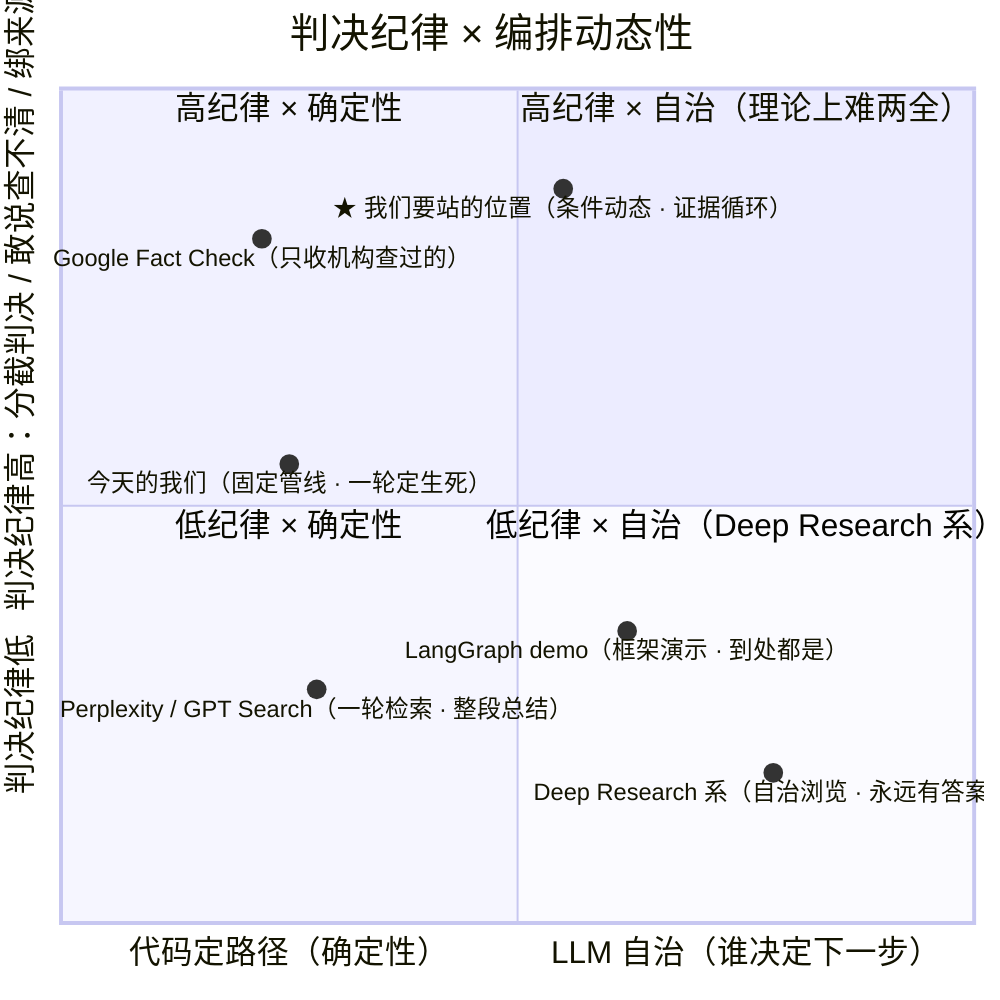

# 红鲱鱼与枪 · 产品说明书

> 产品真相源。赛题是「词元工坊」赛道三：AI Agent · 信息真相猎人。  
> 新结论追加到对应章节，不另起炉灶，也不再发明第二套定位。

## 一、产品是什么

用户丢进来一句话、一张截图或一条链接。系统去**溯源**：这句话从哪来，有没有一手出处，转载有没有添油加醋。查完告诉你：**能信、不能信，还是这一截能信、那一截不能信。** 有问题就指出问题。来源能点开。

有技术含量的是溯源，不是话术。不是搜索总结，不是论证课，不是转发顾问，不是指挥台。

## 二、用户看见什么

```text
材料进来
  → 追出处
  → 直接回答原句（会不会、是不是、哪一层成立）
  → 问题在哪
  → 来源
```

半真半假就点名哪一截站住。查不清就说查不清。没搜到不等于假。过程默认收着。查完可以再问一句，追问留在同一条里；换问题才点再查一条回首页。

### 用户看见的字（输出语言）

检索是工具。用户看见的是判断、问题和可点开的出处，不是谁调了什么工具。

| 只许出现 | 不许出现 |
|----------|----------|
| 对原句的直接回答（会不会、是不是、哪一层成立） | 「能信 / 不能信 / 只能信一部分 / 还查不清」当结论第一句；FactChecker、ReportComposer、search360、Tavily、MiniMax、Agent、智能体、工具调用 |
| 立场型 / 不适用真/假判断 | 灰 |
| 哪一截有出处、哪一截没有 | 先别转发、转不转、建议你转 |
| 来源标题和可点开的链接 | 模型记忆、函数名、检索商标当结论 |

conclusion 第一句直接回答原问题，像 **不会。** / **原句站不住。** / **只有后半截能站住。** 禁止用「能信 / 不能信 / 只能信一部分 / 还查不清」当第一句——那四个词是内部类型（`verdictType` / `faceVerdict`），留给闸门，不盖在脸上。小节标题写成判断本身（「一、已发生的事实：…」），不要写成「问题拆三层 / 分析 / 建议」。recommendation 只重复答案，不写行动建议。代码在收束时再剥一遍工具名和四字章（`publicCopy`），不靠模型自觉。

写法从教材文（如 [工具使用](https://adp.xindoo.xyz/chapters/Chapter%205_%20Tool%20Use/)）借结构，不借题材：

```text
答案。   ← 第一句就回答原问题，不是盖章
对象。   ← 这句话在断言什么
材料。   ← 哪条出处支持或反驳了什么
边界。   ← 仍不能推出什么
```

一句一事。先骨架后填空。抽象判断立刻跟一条具体出处。并列的条目用同一句式。不写「然而 / 截至目前 / 总的来说」起段。结尾不添新主张。不训人。用户发来的下一篇参考，继续抽结构，不抄它的主题。

## 三、赛题评分（为什么后台可以复杂）

| 权重 | 评什么 | 产品上怎么兑现 |
|------|--------|----------------|
| 30% | 准确性 | 对着公开材料核，不靠模型编；混合说法拆开查 |
| 20% | 至少 3 类谣言 | 健康、社会、截图/视频等都能收 |
| 20% | 结果 | 查完有结论，结论能被拿走（报告 / 复制 / 归档），不是「建议你转不转」 |
| 10% | 记忆 / 知识库 / 多 Agent | 查过的能复用；Agent 之间传的是核查材料，不是演戏 |
| 10% | 国产大模型 | 国内模型也能查准 |
| 10% | 360 生态 | 至少接上一个 360 产品（搜索等） |

脸必须简单。准确性要求查的时候可以拆、可以多源、可以打分。

## 四、后台怎么查（实现，不是卖点）

确定性代码管类型、编排、筛选、打分；模型只做需要语义的几步。

1. 材料进入后生成执行计划，按职责裁剪每个 Agent 的输入。
2. **RumorDetector（拆题）**：同一套模型（公网默认 MiniMax-M2.7-highspeed；M3 可显式覆盖）被叫来只做分类，不判真假。拆出原句里真实存在的判断，给每条写 `type` 和 `verifiable`。另一次自证调用丢掉原句没说过的。详见本节「类型谁标」。
3. 可核查判断各自检索（上限 6 条，按负荷选：因果/「导致」优先于带数字，再高于其余）。没进名额的可核查条仍按原句序出现，只能是还查不清。被标成立场/价值的判断不发起证真证伪检索，报告该条写「立场型 / 不适用真/假判断」。读起来像流传说法却被标立场时，代码强制当可核查去查（不是更强分类器）。预测若有公开承诺、正式文件、已发布预测等现在能追溯的抓手，照常检索——查的是抓手，不是未来是否发生；没有抓手则还查不清，不判假。无 http(s) 出处、或只有检索垫上的相关链接，单条和整句都不得停在能信/不能信。
4. **FactChecker / SourceValidator**：按条对照证据，评估来源。
4a. **证据充分性循环**（ADR-004）+ **证据追索**（ADR-005）：核查后对 unverified / 证据冲突的原子按证据缺口生成查询组合（Exact / 原始来源 / 反证 / 时间 / 当事方），多 query 结果做 RRF 融合；同站转载不计入有效增益。补查 2 轮封顶，拿到有效新证据才重跑核查。无证据 ≠ 假。过程层可回看每一跳的目标与缺口，不把检索工具调用当主秀。
5. **ReportComposer**：收束成能信 / 不能信、问题点、来源。只能基于前序输出和检索摘要，不能自己「想起」事实。
6. 0–100 可信度由公式算（`credibilityScore`），不让模型拍分数。

检索并行调用有 key 的源（360 mweb / Tavily / Exa / Metaso / AnySearch 等）；失败不阻断整次。进核查前过筛选漏斗：无 URL 丢掉、去重、按条 top-k。不要对外说「我们只搜好东西」——只是少把不可追溯噪声送进证据链。

无证据 ≠ 假。定向检索无结果 → 未能证实 / 待补证。

### 类型谁标（同一模型换工单，不是更强的分类器）

拆题、核查、写报告的公网默认都是 **MiniMax-M2.7-highspeed**；需要高深度时可显式选择 MiniMax-M3。不是 Mimic，也没有另雇一个更强的模型来认类型。

同一模型被叫多次，每次只许填一张工单：

| 工单 | 谁在跑 | 只许回答 | 不许做 |
|------|--------|----------|--------|
| 拆题 RumorDetector | MiniMax-M2.7-highspeed（可覆盖 M3） | 这句话在断言什么：`type`（事实 / 因果 / 价值 / 预测 / …）和 `verifiable`（能不能去查） | 不许写能信 / 不能信 |
| 自证 | 同一模型 | 这条判断原句有没有说过 | 不许改类型、不许判真假 |
| 核查 FactChecker | 同一模型 | 对着检索来源，这条能核的判断是 true / false / partial / unverified | 不许重新分类 |
| 写报告 ReportComposer | 同一模型 | 根据前序 JSON 直接回答原句；verdictType 用 true / false / mixed_misleading / unverified | 不许自己想起事实；不许把四字章写成第一句 |

代码只读拆题工单上的两个字段决定搜不搜。`verifiable: false` → 不检索、不进真假清单；该条在报告上显示「立场型」「不适用真/假判断」。不要把这叫「灰」——那是内部样式类名，用户看见的是这两句。

例外：读起来像正在流传的判断（含「导致/致癌」这类），即使工单写成立场，代码也强制可核查并检索。这是同一套确定性闸，不是另雇更强模型。

「还查不清」和「证据两边打架」不是拆题标的。那是搜过之后，核查模型写出 unverified，或同一条既有支撑又有反证，代码才再搜或换 StepFun 二审。

证据冲突有第二意见（公网主判 MiniMax-M2.7-highspeed，可覆盖 M3；二审 step-3.7-flash）。**类型标签没有第二模型复核。** 模型整步挂掉会 fail-open（整句当可核查继续搜）。流传说法被标错立场，现在由强制可核查闸兜住。

**已知不满（2026-08-19，创始人提问）**：类型闸在产品里仍不可见，用户看不见「谁标的」。类型仍无第二模型意见。强制检索已落地，不再是未决。

## 五、失败

失败要显式，不能补一段流畅解释糊弄。搜索失败、超时、来源不可达显示为状态。可选 Agent 失败不阻断收束；核心失败则阻断。报告超时走确定性兜底，结构完整、不撒谎、不空白。

## 六、明确不是

- 不是「先别转发」公益广告。
- 不是「转不转」决策工具。
- 不是「可以说 / 不可以说」的措辞教练。用户要的是对原句的直接回答，不是四字章。
- 不是给评委看的多 Agent 运维台。多 Agent 是流水线分工。
- 不是编排框架演示。不迁移 LangGraph / DeepAgents（ADR-002 结论维持）；动态加在证据维度，不加在拓扑维度。
- 不是自治 Agent。LLM 自主决定路径与判决纪律冲突：不可复现、慢、引用会编。
- 不是论证结构课、不是闲聊、不是空间画布。查完可以再问一句，问的还是这条材料，不是把产品改成聊天。

## 七、记录

- （2026-08-13）按赛题原文收回定位：信息真相猎人。用户问题是能不能信。废止「先别转发 / 转不转 / 小陈」作为产品语言。
- （2026-08-13）预测从硬排除改为灰度：有公开承诺/正式文件等现在时抓手则照常查，查的是抓手不是未来；价值/规范仍不发起证真证伪检索。
- 管线、按条检索、公式分、自证闸门的实现细节以代码和 `mvp/docs/` 技术文档为准。
- （2026-08-15）业界对照调研定论：差异轴是**判决纪律**，不是编排动态性。站位「案件级动态路由 + 条件触发升级 + 步骤级确定性执行」，路线 P0–P3 见第八节。
- （2026-08-18）P0 检索政策第一增量（ADR-005 Evidence Pursuit）：Query Portfolio + 辨识力打分 + Evidence Gap + 多 query RRF + 信息增益判停，接到已有 evidenceLoop，不另起 Search Agent。过程 UI 展示证据追索 hops。
- （2026-08-15）编排合理性论证写入第八节：学术背书映射（FActScore/SAFE/FacTool/Self-RAG/CoVe/AIS 等）、弃自主三理由、agentbook 十章对照；三个缺口定为 G1 eval 翻案案例、G2 记忆语义召回、G3 冲突触发真辩论。
- （2026-08-15）G1 已实现：eval golden 集补 evidenceLoop 翻案案例（口语说法与官方口径词表错位类），`mvp/server/eval/score.ts` 增加观测指标 evidenceLoopExpected/Ran/Rescued（触发率与翻案率，不进门禁）。
- （2026-08-15）G2 已实现：记忆语义召回走确定性路线（`mvp/src/lib/semanticRecall.ts`）——领域同义词组桥接 + 汉字字符 Dice + bigram Jaccard 加权合成，零模型零延迟；同义改写零词面交集仍可召回（电瓶车→电动车）。本地 embedding 留作 ADR-001 Phase 3 备选，不在 MVP 引入。
- （2026-08-15）G3 已实现（= P1 兑现）：冲突触发第二模型交叉对抗（`mvp/server/src/lib/crossExam/`）。触发条件确定性（原子命题支撑与反证同时非空才升级）；第二模型国产优先且与主判不同源（MiniMax → MiMo → StepFun）；分歧处置确定性——不重写判词，可信度降分（每分歧 -10、封顶 -20）并标注 contested，报告可审计。935 测试全绿。
- （2026-08-15）G3 真实案例三路径验证：RUMOR-008 无冲突正确不触发（条件触发省 token）；RUMOR-011 触发 AGREE 不降分（二审独立指出相关性≠因果）；RUMOR-013 触发 INCONCLUSIVE 不惩罚（二审发现支撑证据偏题，留痕可审计）。
- （2026-08-15）evidenceLoop 翻案续期：递归深度从固定 2 轮改为按提问质量续命——提问 → 重判 → 判词仍翻转中且问题仍产证据 → 换策略再问（pass 2，round 3-4 走「当事方与原始数据」）；判停全确定性：无新证据（坏问题停）/ 全部收敛（问完了）/ pass ≤2 总轮 ≤4（笼子）。SSE 轮次跨 pass 连续编号可回看。
- （2026-08-15）StepFun Token Plan 接入（Anthropic 协议 `api.stepfun.com/step_plan/v1/messages`，Bearer）：crossExam 第二意见与主判真正双源——主判 MiniMax-M3，二审 step-3.7-flash（生产路径实测：异源自动选中、JSON 干净、带 boundary）。RUMOR-011 本轮一遍收敛无冲突原子，crossExam 合法未触发（条件触发）。
- （2026-08-15）原子级整句守门（`deriveOverallVerdict`）：修复「真假交织被判整体 false」的校准漂移（RUMOR-011 自 08-12 起 verdict 漂移）。规则确定性：有据之真（模型引用 URL 且 bind 对 bundle 校验通过，检索垫的 related-only 不算）+ 有假原子 → mixed_misleading + 公式收 partial（false→cap15 不再触发）；无据不救。配套：fact_checker prompt 增复合句 partial 指引与「肯定判词必须带 URL」硬约束；missingPenalty 封顶 0.15→0.10（缺源是软信号，惩罚不得重于假判词）。真实验证 RUMOR-011 ×2 重复：majority=mixed_misleading / medianCred=20 ∈ [10,35]，全指标 PASS（此前 false/1 FAIL）。951 测试全绿。
- （2026-08-19）拆题类型闸聊清：类型不是更强模型标的，是 MiniMax-M3 填拆题工单（只许写 `type` / `verifiable`，不许判真假）。沟通禁用「灰」。流传说法被标立场 → `forceCheckableAtomTypes` 强制可核查并检索。类型仍无第二模型意见。
- （2026-08-19）《Agentic Design Patterns》21 章对照后已落地：无网址不得真/假；7 条按负荷选 6、未选仍展示为还查不清；eval 能抓半真半假拆反 / 该查不清却下判 / 该搜没搜。总表：`docs/reviews/agentic-patterns/INDEX.md`。验收：`docs/reviews/agentic-patterns/specs/done/`。
- （2026-08-19）结果页逐条清单改读 `claimItems`：原句序、立场型夹在中间、反证 URL 也能点开。整句判断优先用 `faceVerdict`。本地 Vite `/api/agent/orchestrate(-stream)` 与生产同一条 Case Pipeline，不再走 AgentRuntime 实验床。
- （2026-08-19）输出语言按工具使用那一章的产品含义收束：结论只来自检索；用户看见的字不露工具名、不写转不转。见第二节「用户看见的字」；代码闸 `mvp/server/src/lib/publicCopy.ts`。
- （2026-08-27）结论第一句不再盖「能信 / 不能信 / 只能信一部分 / 还查不清」。那四个词留作内部类型。用户看见的是对原句的直接回答。
- （2026-08-27）查完可以再问一句：同一条线程第二轮，气泡是用户的追问，编排入口带上原对象和上一轮回答。再查一条才回首页。不是闲聊产品。
- （2026-08-30）公网默认模型改为 MiniMax-M2.7-highspeed，M3 保留为显式高深度覆盖。原因不是降级判决纪律，而是一次真实健康核查中 M3 多步链超过用户耐心窗口；highspeed 在 120 秒内完成拆题、两条分判与 8 个可点来源。来源摘要 LLM 润色默认退出核心路径，原始搜索摘要直接进入核查。
- （2026-08-30）来源摘要润色（sourceCondenser）整删：默认从未开启，按「非必要不增加」移除开关、超时配置与代码。原始搜索摘要直接进核查的既定行为不变。

## 八、业界对照与差异化（2026-08-15 调研）

「固定流水线 → 动态 DAG → 自治 Agent」比的是**编排动态性**——谁决定下一步（代码 / 计划+条件 / LLM）。这是开发者基建视角：LangGraph demo 评委到处看得到，赛题没有任何一栏给「用了图编排」加分。产品的差异轴是**判决纪律**：分截判决、敢说查不清、结论绑来源。这三件业界没有产品做到。

### 定位图



> 「高纪律 × 中动态」没人占，恰好是准确性 30% 最需要的站位。

### 对照表

| 产品 | 编排 | 判决纪律 | 空缺 |
|------|------|----------|------|
| Google Fact Check | 收录库 | 高，但只覆盖专业机构查过的 | 长尾谣言为零 |
| Perplexity / GPT Search | 一轮检索整段总结 | 低，混合说法只给一个口径 | 不拆半真半假 |
| Deep Research 系 | LLM 自治浏览 | 低，永远有答案 | 不敢说查不清，引用链不可审计 |
| **我们** | 案件级动态路由 + 条件触发升级，步骤级确定性执行 | 高 | —— |

### 站位

**案件级动态路由 + 条件触发升级 + 步骤级确定性执行。** 动态加在证据维度，不加在拓扑维度。站在「谁决定下一步」光谱的中间偏代码侧，理由是可审计——这是自治 Agent 给不了的。

### 演进路线（优先级序）

| 级 | 做什么 | 兑现什么 |
|----|--------|----------|
| P0 | 证据充分性循环 + 证据追索：fact-check 后按缺口补查；Query Portfolio / RRF / 增益判停（ADR-004、ADR-005） | 准确性 30% 的大头；过程上「还缺原始来源 → 换问法 → 命中」可回看 |
| P1 | 冲突触发升级：来源互相矛盾时才触发第二模型交叉对抗（已实现，见第七节 G3 记录） | 国产模型 10%；条件触发省 token 省时间 |
| P2 | 案件类型分支：截图（OCR → 查原图出处）、统计数字（找原始发布）、引语（找回原语境）各有证据策略 | 至少 3 类谣言 20% |
| P3 | 来源独立性：host 聚类 + 文本相似度合并转载链，10 条同通稿算 1 个源 | 便宜，直接抬证据质量 |

P0 回收 `mvp/docs/RECURSIVE_EVIDENCE_SEARCH_PLAN.md` 的 frontier 思想：「用户选 frontier」换成「系统按证据缺口生成 frontier」。

### 编排合理性的学术背书（为什么这样编排是对的）

**为什么不是自主 Agent（三条理由，第三条最硬）：**

1. **判决可复现**。自主 Agent 轨迹审计做得到（记日志），判决审计做不到——同一谣言今天「不能信」、明天「查不清」，回答不了「哪个对、为什么变了」。路径确定 → 判决正确性可拆成每一步的正确性，每一步可单独测试。
2. **失败有界**。我们的循环只有 4 种死法（搜到 / 没新证据 / 问法用完 / 搜索挂了），每种显式上报。自主循环的死法是开放的——AI Agent 教材 Ch.2 自己警告：Agent 会无限重复同一工具调用，生产必须加 max_iterations。我们的 evidenceLoop 从第一天就带笼子。
3. **行动空间可枚举**。自主性值钱的场景是「下一步无法预知」（写代码、开放式研究）。核查域每个节点的下一步只有三种（继续查 / 换问法 / 停），规则写得出来。把已知确定性的决策写成代码，不是保守，是白拿。

**模块 ↔ 学术出处（逐条可翻）：**

| 我们的模块 | 学术背书 |
|-----------|----------|
| claimAtom 原子分解 | FActScore（Min et al., EMNLP 2023）、SAFE（Wei et al., 2024, Google DeepMind）：整段打分不可靠，分解成原子事实逐条判更准 |
| decompose-then-verify 管线 | FacTool（Chern et al., ICLR 2024）：工具增强核查的标准形态 |
| evidenceLoop 按需再检索 | Self-RAG（Asai et al., ICLR 2024）、FLARE（Jiang et al., EMNLP 2023）：不确定时才触发再检索 |
| 补到证据 → 重判 | Chain-of-Verification（Dhuliawala et al., 2023, Meta）：自我验证压幻觉 |
| 引用绑定、剥虚构 URL | AIS 框架（Rashkin et al., 2021, Google）：attribution to identified sources——我们做成代码强制 |
| 确定性审稿器 | Let's Verify Step by Step（Lightman et al., 2023, OpenAI）：逐步验证优于整体打分 |
| 确定性编排 + LLM 语义步 | Anthropic《Building Effective Agents》（2024）：能拆成确定性步骤就用 workflow；机器人学同款选择是行为树（Colledanchise & Ögren, 2018）替代端到端策略 |
| 模型 fallback 链 | FrugalGPT（Chen et al., 2023, Stanford）：级联降级是成本/质量权衡标准做法 |
| 半真半假拆开判 | 《Information Disorder》（Wardle & Derakhshan, 2017）：虚假信息多为真假交织的混合体 |

**为什么这套恰好适合这个域**：产品语义本身就是「哪一截能信」——这**要求**逐条判决，而逐条判决恰好是 decompose-then-verify 的形状。不是我们选了学术管线，是产品定义和文献最优结构同形。**架构跟随产品语义，产品语义有文献背书。**

**有效性证据**：外部（FActScore/SAFE/FacTool 一致显示分解逐判优于整段总结）+ 内部（路径确定 → 906 测试 + eval gate 卡 baseline，每次 CI 重验）。

**诚实边界**：开放任务（写代码、开放式研究）行动空间不可枚举，自主 agent 是正解——我们不碰那个域。知道架构不适用哪里，和知道它适用哪里，是同一水平的工程判断。

### 与 Google《AI Agent》教材（agentbook）十章的对照

| 章 | 教材能力 | 我们 | 说明 |
|----|---------|------|------|
| 1 | Agent 基础（模型+工具+循环） | ✅ 有 | 多模型 fallback、检索工具、evidenceLoop 是带笼子的 agent 循环 |
| 2 | 上下文工程 | ✅ 有 | 代码即标注：状态栏、Skills 按需加载、按职责裁剪 Agent 输入 |
| 3 | 记忆/知识库 | ✅ 有 | 案例记忆闭环在；语义召回已补（同义词组 + 字符 Dice，确定性零依赖，G2） |
| 4 | 工具 | ✅ 有 | 5 家搜索源并行、失败不阻断。LLM 自选工具经 ADR-002 评估后**主动不做** |
| 5 | 编码 Agent | ➖ 不适用 | 域外 |
| 6 | 评估 | ✅ 有 | eval 框架 + gate 在；golden 集已补 evidenceLoop 翻案案例与触发率/翻案率观测指标（G1） |
| 7 | 模型后训练 | ➖ 不做 | API 模型 + 提示工程 + fallback 链足够，ADR-001 已裁 |
| 8 | 持续进化 | ✅ 有 | 记忆候选→入库→注入闭环在；语义召回（G2）解除同义改写召回限制 |
| 9 | 多模态/实时 | ✅ 有 | 截图走 StepFun Vision；过程 SSE 实时流 |
| 10 | 多 Agent 协作 | ✅ 有 | 6 Agent 分工传证据在；冲突时第二模型（国产优先、不同源）真交叉复核，分歧降分不重写判词（G3） |

三个缺口即三个开发项：**G1** eval 补翻案案例（护住 evidenceLoop）、**G2** 记忆语义召回（评分项 10%）、**G3** 冲突触发真辩论（= P1，同时兑现国产模型 + 多 Agent 两项 10%）。**三项已于 2026-08-15 全部实现**（见第七节记录），十章对照不再有 ⚠️。
