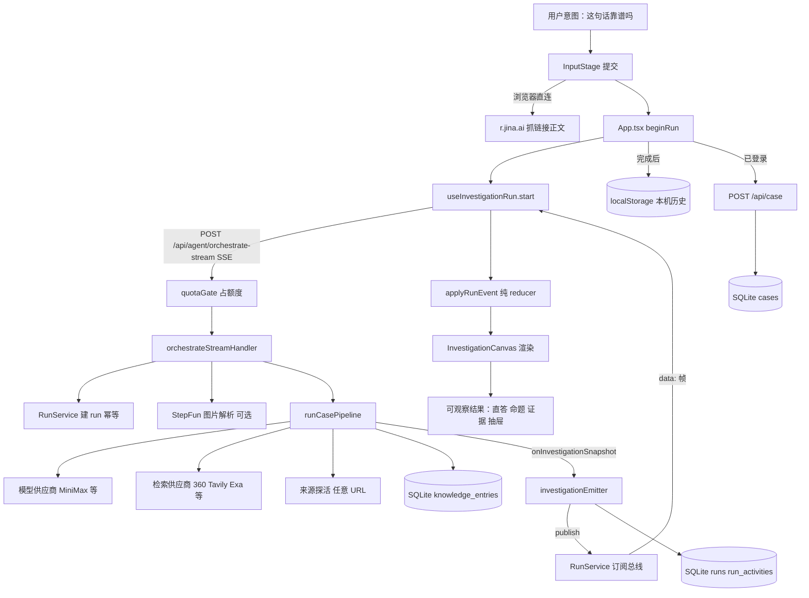

# 现有架构（2026-09-29，基线 `f96a37f`）

只写代码**实际**怎么接在一起，供重写对照。运行时接线的日常说明仍是 `ARCHITECTURE.md`，文件为什么在这里见 `REPO.md`。
行为见 `behavior-spec.md`，状态见 `state-model.md`，对外契约见 `external-contracts.md`。

## 1. 系统地图：一次调查从意图到结果



## 2. 进程与存储拓扑

```text
浏览器 ─────────────┬── Vite 静态（生产：Nginx /opt/red-herring/dist）
  React SPA          │
  localStorage       └── /api /health /mcp /r /s /uploads ──► Express（单进程）
  cookie                                                     │
  r.jina.ai（直连）                                           ├─ 进程内存：run 活体表、订阅者、额度桶、
                                                             │  provider 跳过表、案件写入限流、会话
                                                             ├─ SQLite  $DATA_DIR/rhg.sqlite
                                                             │  cases runs run_activities shares
                                                             │  knowledge_entries schema_version
                                                             ├─ JSON 快照  accounts.json quota.json（5s 周期落盘）
                                                             ├─ JSONL  knowledge-observations followup-observations
                                                             │         rhg-feedback .agent-memory/candidates
                                                             ├─ 临时图床  $UPLOAD_DIR/rhg-uploads（24h 清扫）
                                                             └─ 外部：模型、检索、视觉、以图搜图、探活、
                                                                邮件（Resend/SMTP）、AI Ping OAuth、本地 codex
```

单机单进程部署（`./ops.sh deploy --yes` → 阿里云 Docker + Nginx）。没有队列、没有第二个实例；所有「全局」状态都在这一个进程里。

## 3. 代码量与分层

生产 TypeScript 约 42,450 行（不含测试 32,000 行、CSS 22,400 行），测试 152 个文件 1,442 条标题。

| 层 | 路径 | 行数 | 职责（现状） |
|---|---|---|---|
| 入口 | `server/src/index.ts` | 292 | Express 组装、路由、CORS、上传清扫、快照循环、auth 路由内联 |
| HTTP + 编排 | `server/src/handlers.ts` | 1,337 | 见第 4 节，一个处理器做十件事 |
| 编排 | `server/src/lib/casePipeline/runCasePipeline.ts` | 1,541 | 见第 5 节，单函数约 1,080 行 |
| 供应商 | `providerRouter` 1,186 · `agentProviders` 584 · `orchestrate` 458 · `orchestrateByo` 380 · `minimaxM3` · `anthropicParse` | ~2,900 | 模型路由、重试、JSON 修复、跳过表、BYO |
| 提示词 | `server/src/lib/agentConfigs.ts` | 971 | 6 个 agent 的 prompt、schema、输入构造、`mergeSubclaimVerdicts` |
| 检索 | `searchProviders` 1,206 · `atomSearch` 673 · `atomSearchQuery` 319 · `retrievalFilter` · `evidencePursuit` 463 · `evidenceLoop` 677 | ~3,500 | 并行矩阵、按命题检索、查询组合、补查循环 |
| 判决规则 | `domain/verdict.ts` 64 · `sentenceVerdict` · `wholeClaimAudit/*` 1,268 · `reportReviewer` 322 · `citationBinding` 403 · `citationLiveness` 254 · `sourceRelationAudit` · `publicCopy` 395 · `factDeskPostProcess` 261 · `reportFallback` 282 · `formulaScore` · `credibilityScore` | ~4,000 | 收权、守门、重绑、清洗、兜底 |
| 快照契约 | `server/src/lib/investigation/*` | 1,885 | `InvestigationSnapshotV1` schema、builder、活动、不变量；与 `packages/core` 字节镜像 |
| 运行与存储 | `runService` 239 · `runStore` 242 · `caseStore` 262 · `sqliteStore` 188 · `shareHandlers` 379 · `knowledgeStore` 535 · `accountStore` 346 · `checkQuota` 397 | ~2,600 | 见 `state-model.md` |
| 前端壳 | `src/App.tsx` | 923 | 见第 6 节，产品状态几乎全在这一个组件 |
| 前端 SSE | `goldenPath/useInvestigationRun.ts` 327 · `lib/agentExpansion.ts` 437 · `lib/investigationResume.ts` | ~870 | 唯一 SSE 消费点，纯 reducer `applyRunEvent` |
| 前端界面 | `src/goldenPath/*` | 6,042 | 画布、命题卡、结论、抽屉、活动流、追问、分享 |
| 样式 | `src/styles.css` 17,556 · `goldenPath/golden-path.css` 4,882 | 22,438 | `styles.css` 大部分服务于已删除的旧三栏壳 |

## 4. `orchestrateStreamHandler` 的十件事

一个 430 行的闭包同时负责：

1. 解析请求（claim、intake、memoryRecall、modelChoice、clientRequestId、followUp、priorRound、byoKey）。
2. BYO 配置校验与 SSRF 检查；畸形时退额度 400。
3. 模型选择校验。
4. 追问归属校验（读案件库）。
5. 建 run（幂等 / 冲突 / 订阅已有 run）。
6. SSE 帧格式、心跳、订阅总线、公开事件清洗（`toPublicStreamEvent`）。
7. 图片解析（StepFun Vision）并改写 claim。
8. 组装管线依赖（runAgent、searchOne、自证、改写、质询、整句审计、知识库、追问复用、报告、钩子、收尾）。
9. 时限赛跑：总时限、`timeout_pending`、宽限、确定性超时报告。
10. 失败分类与额度结算：取消 / BYO 失败 / 超时 / 断连 / 服务端错误，各自决定计费或退还、发哪些帧、落哪个终态。

第 10 件是这里最脆的地方：结算规则散在 5 个 catch 分支里，顺序即语义。

## 5. `runCasePipeline` 的阶段链

```text
received 快照
 └ 拆题 rumor_detector（失败 fail-open：整句当一条可核查命题）          ← 追问复用时跳过
    └ 收窄：collapseNarrative → collapseFollowUp → ensureLeap
       └ decomposed 快照（或 received+checking）
          └ 自证（全丢重试一次，仍全丢 fail-open 保留全部）
             └ forceCheckable 类型闸
                └ 整句审计 Planning（可核查性修订）                    ← 需 >45s 余量
                   └ decomposed 快照
                      └ 逐命题检索（≤6，知识库 / 上一轮复用先查）  investigating 快照 ×N
                         └ fact_checker → source_validator → 来源关系审计（fail-closed）
                            └ judging 快照
                               └ 证据追索循环（≤2 pass × 2 轮，需 >100s）  judging 快照
                                  └ 有界质询（≤2 命题，需 >45s）
                                     └ 审计刷新  judging 快照
                                        └ afterFactSource（共识帧，220ms 间隔）
                                           └ 因果增强（有 causal 原子且 >90s）
                                              └ 整句审计 Evaluation（≤3 问，1 次补查，可重评）
                                                 └ 审计刷新
                                                    └ 报告：LLM report_composer 或确定性兜底
                                                       └ 收尾链（约 20 步原地改 finalReport）
                                                          └ complete 快照
                                                             └ 知识库 conclude / settle
                                                                └ 记忆候选 propose
```

每个阶段边界检查一次取消信号。时间预算常量散在函数体里：`COMPOSER_RESERVE_MS 90s`、`CROSS_EXAM_MIN_MS 45s`、`EVIDENCE_PASS_MIN_MS 100s`、`AUDIT_MIN_MS 45s`、来源审计刷新 `20s`。

阶段之间传数据的方式有三种并存：闭包里的可变局部变量（`factStep`、`sourceStep`、`atomSearchBundle`、`auditUnresolvedGaps`）、`steps` 数组按 agentId 读最新一条、以及直接改 `rumorStep.output` 上的字段。

## 6. 前端状态归属

```text
App（ProductApp，923 行）
 ├ useState ×15：mode active cases historyReady historyNotice account loginOpen accountOpen
 │               sameClaim saveStatus draftClaim selectedRoundId pendingFocus …
 ├ useRef：scopeVersion accountEmailRef activeIdRef persistedRoundRef resumedRef
 ├ useInvestigationRun()  ← RunState（纯 reducer applyRunEvent）
 ├ effects：账户与历史水合 · 刷新接回 · 进行中指针写入 · 完成后落库 · 调整重点等终态
 └ 渲染 ProductShell
     ├ InputStage（自带探针、额度、链接抓取、附件状态）
     ├ InvestigationThreadHeader
     └ InvestigationCanvas（563 行）
          ├ WorkRoles · ThinkingDisclosure · ActivityFeed · InvestigationScope
          ├ ConclusionHero · EvidenceBoard/EvidenceItem · ClaimSection
          ├ SourceDrawer（469 行）
          ├ FollowUpSection · ShareControl · InvestigationDossier
          └ ReasoningProvider（外层包裹，无消费者）
```

`App.tsx` 同时承担：账户会话、历史水合与合并、本机与服务端两路落库、进行中指针、刷新接回、同句守卫、首页案例、追问拼装、调整重点的「先停后开」、登出清理、三个路由分支。`useInvestigationRun` 与 `applyRunEvent` 是前端唯一结构清楚的状态机。

## 7. 依赖方向（现状）

```text
apps/src  ──再导出──►  apps/server/src/lib/{investigation, claimAtom, interruptedSnapshot, investigationThread}
apps/server/src/lib/{checkQuota, accountStore, emailAuthHandlers}  ──导入──►  apps/src/lib/{checkQuota, accountIdentity}
apps/server/src/lib/investigation  ◄──字节镜像──►  packages/core/src/investigation（mirror.test.ts）
packages/core 其余拷贝（publicCopy searchProviders citationBinding agentProviders …）已冻结、已漂移
```

前后端双向互相导入：前端从服务端拿快照契约与命题键，服务端从前端拿额度常量与账号显示名。

## 8. 从入口不可达的生产代码

用 esbuild 从 `src/main.tsx` 与 `server/src/index.ts` 两个入口打包，比对 `git ls-files`：

| 文件 | 行数 | 说明 |
|---|---|---|
| `server/src/lib/piBridge/*`（4 个） | 420 | 只被 `server/eval/probePi*.ts` 引用；`@earendil-works/pi-coding-agent` 依赖因此只服务探针 |
| `server/src/lib/casePipeline/testSourceRelationAudit.ts` | 72 | 测试辅助放在生产目录 |
| `src/data/reasoningCanvas.ts`、`src/store/reasoningStore.tsx` | 785 | 可达但无消费者：`ReasoningProvider` 包在外层，`useReasoning` 零调用 |
| `src/lib/agentConfigs.ts` | 1,040 | 生产路径只取类型；实体只被测试引用 |
| 类型文件（`schemas.ts` ×2、`*Types.ts` 等） | — | 只提供类型，打包时被擦除，属正常 |

`src/styles.css` 17,556 行多数选择器属于已删除的旧三栏壳，需按像素对比确认后再删。

## 9. 与架构有关的历史

| 日期 | 提交 | 变化 |
|---|---|---|
| 2026-08-30 | `f028ebf` `2e299cc` `9484714…` | `handlers.ts` 从 3,793 行拆到 1,272 行；删客户端 AgentRuntime、死组件、死路由 |
| 2026-09-03 | `dc16f9a` | ADR-007：CaseFile 脊柱（事件溯源、代码裁判），`packages/` 建成 |
| 2026-09-06 | `5bd853d` | `InvestigationSnapshotV1` 统一白盒契约（#51） |
| 2026-09-14 | — | `agentLoop` 删除，ADR-006 废止 |
| 2026-09-28 | `1d08096` | 删除 `/?legacy=1` 旧三栏壳，前端 23,666 → 13,853 行 |
| 2026-09-28 | `932c52f` | T20 暂停：`apps/` 是生产唯一真相，`packages/` 冻结 |
| 2026-09-28 | `3d75d62` | 整句判定收成 `domain/verdict.ts` 一处决定，带 domain 边界测试 |

T20 暂停的理由（`devlog/2026-09-28-pause-t20.md`）直接约束本次重写：另起一套平行系统再切换，实际就是一次推倒重来；两边同时写，代码会互相对不上。所以本次重写在 `apps/` 内部逐片替换，不另起平行系统。
