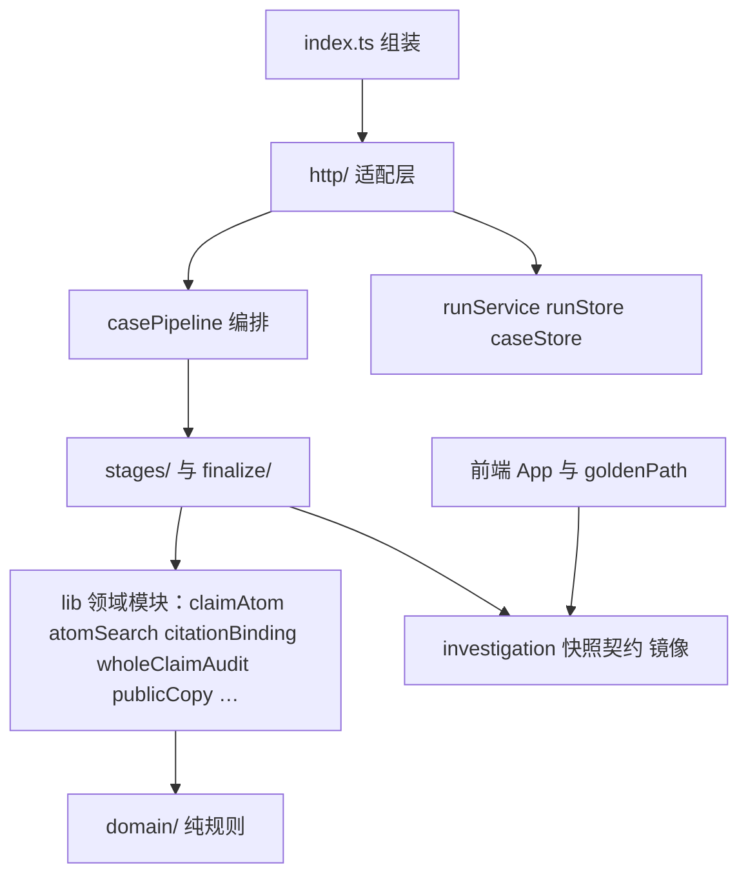

# 目标架构（行为保持重写，2026-09-29）

目标只有一个：对外行为一字不改（`behavior-spec.md`、`external-contracts.md`），把内部换成边界清楚、状态显式、一处只放一个事实的结构。
这里每一个新增的模块或抽象，都要说清它解决的是现在哪一种出过事、或者很容易出事的失败方式。说不出来的就不加。

## 1. 不做的事

| 不做 | 原因 |
|---|---|
| ADR-007 的事件溯源、`judge()` 纯规则判真假、控辩双方、消息路由 | 这些会改变判决结果与界面，属于产品变化，不是行为保持重写。重写完成后可以作为单独的产品决策再议 |
| 复活 T20、往 `packages/` 写 | 2026-09-28 暂停的理由（平行系统等于推倒重来、双写漂移）仍然成立 |
| 重写 provider 路由、检索矩阵、提示词 | 它们直接决定外部请求内容；改动会让录音对不上、也最难证明等价。只在收尾阶段做死代码清理 |
| 按「目录好看」搬文件 | 搬家不解决失败方式，只增加 diff |
| 前后端共享包（`shared/`） | 要改 Docker 打包与 Vite 配置；现有双向再导出能用，收益小 |

## 2. 服务端：调查管线

### 2.1 现状的失败方式

1. **收尾链顺序即语义，但顺序藏在一个 1,080 行的函数里。** 同一个 `finalReport` 被约 20 个函数依次原地改；整句判定曾在约 10 处各改一次（9-28 错误分析：官方辟谣最后被写成「证据不足」、徽章与标题矛盾）。新加一道关卡放在哪一行，结果就不一样，而且没有地方能一眼看出全部顺序。
2. **阶段之间的数据走三种隐式通道。** 闭包可变变量（`factStep`、`sourceStep`、`atomSearchBundle`、`auditUnresolvedGaps`）、`steps` 数组里按 agentId 找最新一条、直接改 `rumorStep.output` 的字段。哪个阶段读了哪个事实，只能逐行读代码才知道。#90（中途绿色支持、终态再纠正）就出在来源审计与核查结果交错更新的地方。
3. **时间预算散在函数体各处。** 90s、45s、100s、45s、20s 五个阈值，外加「报告写作需要 max(90s, 180s)」。慢调查为什么跳过了报告写作（golden g01 真实运行就是这样收束的），要把整个函数读完才知道。
4. **里程碑快照靠 patch 累积。** `emitInvestigation` 把每次的 patch 合进 `investigationBase` 再整份重建，外加 `selectedScopePlan` 的旁路赋值。快照顺序本身是产品行为（首份 judging 快照必须已经过来源审计，`behavior-spec` 4.8）。

### 2.2 目标形状

```text
apps/server/src/lib/casePipeline/
  runCasePipeline.ts        只剩阶段顺序与「这一阶段跑不跑」的判断；对外签名不变
  caseState.ts              显式的进行态：命题与类型、检索包、核查与审计步骤、审计缺口、追索与质询记录
  budget.ts                 时间预算：阈值常量与具名判断（canPursueEvidence / canCrossExamine / mustWriteDeterministicReport …）
  snapshotTimeline.ts       里程碑快照：received / decomposed / investigating / judging / complete 各一个方法
  stages/
    decompose.ts            拆题 → 收窄 → 自证（含重试与 fail-open）→ 类型闸 → 整句审计规划
    retrieve.ts             逐命题检索（知识库与上一轮复用），不改检索策略
    judge.ts                核查 → 来源审计 → 审计刷新（fail-closed）
    pursue.ts               证据追索循环（pass / 轮次 / 判停不变）
    crossExamine.ts         有界质询
    enrichCausal.ts         因果增强
    evaluateWholeClaim.ts   整句审计评估 → 补查 → 提交判定 → 重评
    compose.ts              报告：LLM 或确定性兜底
  finalize/
    finalizeReport.ts       收尾链的唯一出口：一张有序步骤表
```

| 新模块 | 解决 2.1 的哪一条 | 深度（接口小、实现多） |
|---|---|---|
| `finalize/finalizeReport.ts` | 1 | 输入：组装后的报告 + 进行态 + 探活端口；输出：终态报告。内部 20 步按表顺序执行，每步一个具名条目，顺序在一处可读、可测 |
| `caseState.ts` | 2 | 各阶段只通过进行态读写；字段名就是事实名（`factVerdicts`、`sourceAudit`、`auditGaps`），一个事实只有一个家 |
| `budget.ts` | 3 | 所有「剩余时间够不够」的判断集中；阈值数值不变 |
| `snapshotTimeline.ts` | 4 | 快照累积与发出在一处；阶段只调具名方法，顺序可测 |
| `stages/*` | 2 | 每个阶段是一个函数：`(state, deps) → Promise<void>`；阶段内逻辑原样搬，不重写算法 |

不新增：阶段插件机制、通用 pipeline 框架、事件总线。阶段是固定的八个，写成八个函数调用就够了。

### 2.3 收尾链的显式顺序（与现有代码一一对应，不改顺序）

```text
assemble → mixedGuard → earlyGate → tinyBound → finalizeHook(公式分 · 口吻清洗 · 截图语境)
→ attachCrossExam → attachPursuit → review → rebindCitations → imageOrigin → pruneDeadCitations
→ finalGate → repair(+rebind +imageOrigin) → sentenceVerdict → rebind → imageOrigin
→ followUpLead → unopenedLink → faceVerdict → checkedAt → completeSnapshot
```

每一步读哪些输入、改哪些字段写在步骤表条目里。这张表就是 `behavior-spec` 12.1 的可执行版本。

## 3. 服务端：HTTP 适配层

### 3.1 现状的失败方式

1. **结局与额度结算散在 5 个 catch 分支里，分支顺序即语义。** 历史上出过「超时收尾先退还再计费，commit 变空操作，超时等于白嫖」（handlers.ts B2 注释）、「取消后迟到的完成帧覆盖已停止」、「HTTP 回执覆盖 SSE 已停止」。
2. **一个处理器做十件事**（`architecture-current` 第 4 节），SSE 写帧、心跳、订阅在两个处理器里各写一份。

### 3.2 目标形状

```text
apps/server/src/http/
  orchestrateStream.ts   解析请求 → 校验（400/409 的判定）→ 建 run → 交给 InvestigationRun
  investigationRun.ts    一次调查的生命周期：图片解析、管线接线、时限赛跑、结局分类、按结局结算额度与发终态帧
  sseChannel.ts          帧格式、公开清洗（toPublicStreamEvent）、心跳、订阅总线接线
```

| 新模块 | 解决 | 关键设计 |
|---|---|---|
| `investigationRun.ts` | 3.1-1 | 结局是封闭枚举：`completed / cancelled / byo-failed / timed-out / client-gone / server-error`；一张表写每种结局发哪些帧、额度 commit 还是 release、run 落什么终态。表的内容逐条照搬现有分支 |
| `sseChannel.ts` | 3.1-2 | 两个 SSE 端点共用；帧字节不变 |
| `orchestrateStream.ts` | 3.1-2 | 请求解析是纯函数，返回 `{ok, request}` 或 `{status, body, releaseQuota}` |

`handlers.ts` 在切片完成后只剩对这三个模块的组装与其余小处理器。

## 4. 前端：产品壳

### 4.1 现状的失败方式

`App.tsx` 一个组件 923 行，15 个 `useState`、5 个副作用互相读写：账户、历史、落库、进行中指针、刷新接回、追问、调整重点都在里面。出过的事：从首页进入调查不回页顶（9-28）、换案件后迟到的保存结果改错了状态（`isCurrent` 守卫）、登出后迟到的旧响应渲染出来（`scopeVersion`）。这些守卫都是对的，但散在各处，很难看出哪个状态被谁保护。

### 4.2 目标形状

```text
apps/src/
  App.tsx                         路由分支 + 组合下面四个 hook + 布局（不再持有业务状态）
  app/useAccountSession.ts        me / 登录后水合 / 登出；持有 scopeVersion 与 accountEmailRef
  app/useCaseHistory.ts           历史列表：水合与合并、落库（本机 + 服务端）、打开历史、同句守卫
  app/useRunPointer.ts            进行中指针的读写与刷新接回
  app/useActiveInvestigation.ts   当前案件：开跑、追问、调整重点、重查、回首页
```

每个 hook 只拥有自己那部分状态，守卫跟着它保护的状态走。`useInvestigationRun` 与纯 reducer `applyRunEvent` 已经是好形状，不动。

## 5. 依赖方向



规则：`domain/` 不引用任何外部模块（已有边界测试）；`stages/` 与 `finalize/` 不引用 `http/`；`http/` 不写判决规则。

## 6. 完成判定

- golden 服务端场景与界面场景在新旧代码上逐项相同（`golden-scenarios.md`）。
- `runCasePipeline.ts` 不再含收尾链与阶段内逻辑；`handlers.ts` 不再含结局分支；`App.tsx` 不再持有历史、指针、账户状态。
- 旧实现（内联收尾块、内联阶段、catch 分支、App 内联状态）全部删除，没有兼容垫片留在生产路径。
