# 红鲱鱼与枪 · 实施方案全景图

> 渲染方式：GitHub / VS Code Markdown Preview Mermaid / obsidian-mermaid 等支持 Mermaid 的阅读器。
> 节点颜色：🟢 = 已完成 · 🟡 = 进行中 · ⚪ = 未启动

```mermaid
flowchart TB
    Start([🎯 中文 AI 核查 Agent<br/>差异化护城河]):::goal

    %% ==================== 阶段 0: 竞品调研 ====================
    Start --> Research[📊 竞品调研<br/>5 个维度]:::phase
    Research --> R1[国际事实核查<br/>Logically · FullFact ·<br/>ClaimBuster · Google]:::done
    Research --> R2[中文市场<br/>腾讯较真 · 央媒求证 ·<br/>字节 AI 求真]:::done
    Research --> R3[AI 搜索引擎<br/>Perplexity · Grok ·<br/>秘塔 · Kimi]:::done
    Research --> R4[论证分析<br/>Kialo · IBM Debater ·<br/>Logically.app]:::done
    Research --> R5[学术研究<br/>Consensus · Elicit ·<br/>Scite]:::done
    R1 & R2 & R3 & R4 & R5 --> Plan[📋 实施方案<br/>implementation-plan.md<br/>18 KB · 17 任务]:::done

    %% ==================== P0: 基础设施 ====================
    Plan --> P0{P0 整波<br/>4 任务 / 47 测试}:::phase
    P0 --> P0_1[P0-1 Grounding 硬约束<br/>FactChecker + SourceValidator<br/>prompt 5 条强制约束]:::done
    P0 --> P0_2[P0-2 求证语言模板<br/>「求证：网传…，经核查」<br/>canSay/cannotSay 防御]:::done
    P0 --> P0_3[P0-3 ClaimReview JSON-LD<br/>schema.org/ClaimReview<br/>双层 XSS 防御]:::done
    P0 --> P0_4[P0-4 公式快照闸门<br/>6 fixture 锁定 computeCredibilityScore<br/>SCORE_LABELS 文本]:::done

    %% ==================== P1: 增强能力 ====================
    P0_4 --> P1{P1 整波<br/>6 任务 / 63 测试}:::phase
    P1 --> P1_1[P1-1 IBM KPA<br/>Key Points 抽取<br/>support/oppose/context]:::done
    P1 --> P1_2[P1-2 Kialo 子命题树<br/>parentId/stance/order<br/>orphan + cycle 检测]:::done
    P1 --> P1_3[P1-3 句子级引用溯源<br/>CitationSpan 4 种 mediaType<br/>quote 必须是原文子串]:::done
    P1 --> P1_4[P1-4 来源历史信誉<br/>~/.gun/ LRU 持久化<br/>只展示不入公式]:::done
    P1 --> P1_5[P1-5 逻辑谬误诊断<br/>strawman/false_cause/<br/>hasty_gen/ad_hominem/<br/>appeal_to_authority]:::done
    P1 --> P1_6[P1-6 盲点视图<br/>同源转载折叠<br/>独立来源 <3 标样本不足]:::done

    %% ==================== P2: 远期能力 ====================
    P0_3 --> P2{P2 整波<br/>6 任务 / 96 测试}:::phase
    P2 --> P2_1[P2-1 学术通道<br/>DOI 去重 + Consensus<br/>APA/MLA/Chicago 引用]:::done
    P2 --> P2_2[P2-2 PDF 阅读<br/>text/scan/encrypted/<br/>fake_extension 4 case]:::done
    P2 --> P2_3[P2-3 NATO Admiralty<br/>A-F × 1-6 双轴<br/>F/6 兜底]:::done
    P2 --> P2_4[P2-4 时间衰减<br/>4 种 domain 策略<br/>historical 豁免]:::done
    P2 --> P2_5[P2-5 编辑室/学术模式<br/>general/newsroom/research<br/>互斥校验]:::done
    P2 --> P2_6[P2-6 多语言<br/>detectLanguage 4 档<br/>alignKey 中英对齐]:::done

    %% ==================== 接入层 ====================
    P0_3 --> Access{接入层<br/>SSE + UI 集成}:::phase
    Access --> A1[SSE complete 事件<br/>新增 claimReview 字段<br/>server-side buildClaimReviewJsonLd]:::done
    Access --> A2[UI 脚本注入<br/>injectClaimReviewScript<br/>single tag 闸门 + </script 转义]:::done
    Access --> A3[SSE 客户端桥接<br/>handleStreamComplete<br/>claimReviewStream 模块]:::done

    %% ==================== 可选 / 远期 ====================
    P1 --> Opt1[P1 → Mission Control<br/>UI 接入<br/>需 jsdom 环境修复]:::optional
    Access --> Opt2[报告 URL 永久路由<br/>/r/:caseId<br/>影响 SEO]:::optional
    Access --> Opt3[ClaimReviewBadge 组件<br/>「复制 JSON-LD」按钮<br/>Rich Results Test 集成]:::optional
    P2_1 --> Opt4[学术付费 API<br/>Crossref 免费 vs<br/>Semantic Scholar 限速]:::optional
    P2_5 --> Opt5[编辑室邀请制<br/>批量审批人上限]:::optional
    P2_6 --> Opt6[多语言首期范围<br/>后端规范化 vs UI i18n]:::optional

    %% ==================== 验证 ====================
    P0_4 & P1_6 & P2_6 & A3 --> Verify[🧪 全量验证<br/>21 文件 / 227 测试<br/>0 回归]:::done
    Verify --> Done([✅ 全部完成]):::goal

    %% ==================== 样式 ====================
    classDef done fill:#90EE90,stroke:#228B22,color:#000
    classDef phase fill:#FFE4B5,stroke:#FF8C00,color:#000
    classDef goal fill:#87CEEB,stroke:#4682B4,color:#000
    classDef optional fill:#F0F0F0,stroke:#808080,color:#000,stroke-dasharray: 5 5
```



## 状态图例

| 符号 | 状态 | 数量 |
|------|------|------|
| 🟢 实心绿 | 已完成 | 17 任务 + 接入层 3 模块 + 全量验证 |
| 🟡 橙色 | 阶段标题 | 5 阶段 |
| ⚪ 灰虚线 | 可选 / 远期 | 6 项用户拍板项 |

## 关键依赖链

```mermaid
flowchart LR
    A[computeCredibilityScore]:::critical --> B[P0-4 快照]
    B --> C[后续 P1/P2 改动]
    C --> D{破公式?}<br/>|No| E[✅ PASS]
    C --> F{破公式?}<br/>|Yes| G[❌ CI 红线]
    G --> H[必须更新快照后 PASS]
    H --> E

    classDef critical fill:#FFB6C1,stroke:#DC143C,color:#000
```

## 7 大护城河 vs 19 任务

| 护城河 | 承担任务 |
|--------|---------|
| 命题类型自动拆解 | P0-1 grounding（事实/价值/策略分离）+ P1-1 KPA + P1-2 子命题树 |
| 子命题独立支持/反驳树 | P1-2 Kialo 子命题树 |
| 公式化 0-100 评分 | P0-4 公式快照 |
| 证据四维评估 + 第 5 维 | P0-3 ClaimReview reviewRating + P1-3 引用溯源 + P1-4 来源信誉 |
| can say / cannot say 边界 | P0-1 grounding + P0-2 求证模板 + P1-5 谬误诊断 |
| Mission Control 实时可视化 | (P1 纯逻辑已就绪，UI 接入为可选) |
| ClaimReview JSON-LD 兼容 | P0-3 纯逻辑 + 接入层 SSE/UI |

## 累计成果

- **总测试**：227 / 227 PASS
- **总文件**：~38 修改或新增
- **总耗 token**：~104M
- **plan 覆盖率**：17 / 17 任务完成（仅 6 项可选/拍板项未做）
