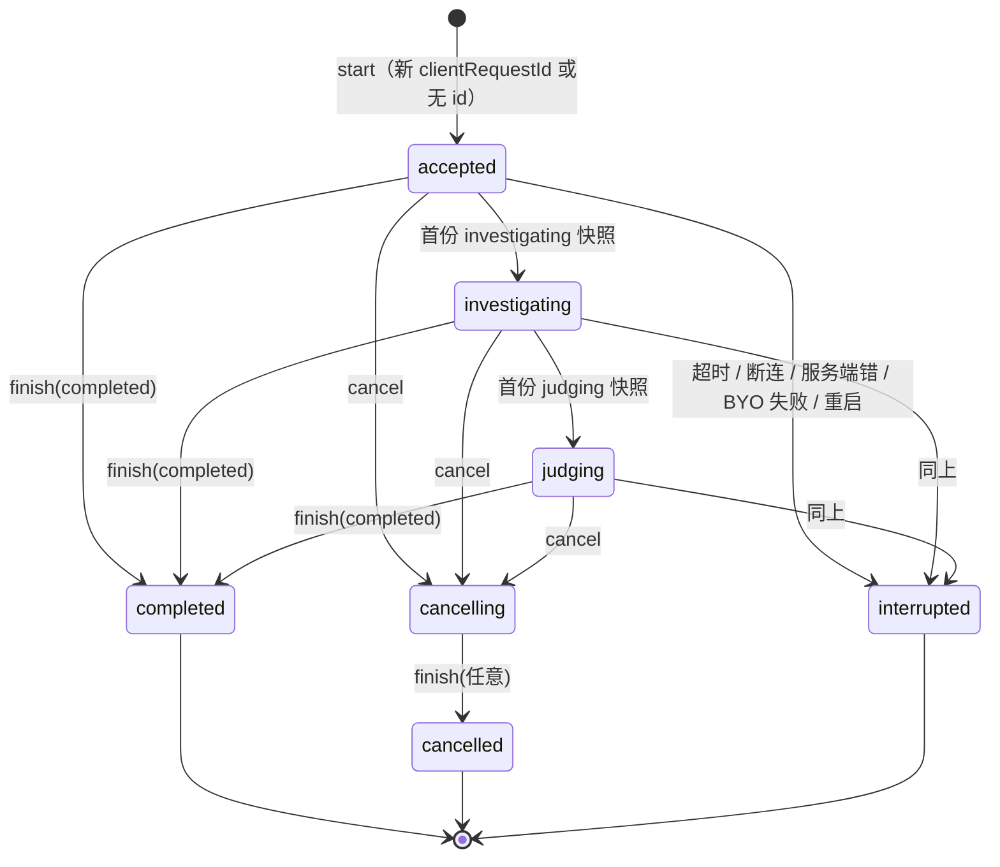

# 状态模型（现状，2026-09-29，基线 `f96a37f`）

每一份状态写清：住在哪、谁写、谁读、什么时候丢、坏了怎么恢复。重写时状态的**位置可以换，语义与失败后的表现不能换**。

## 1. 状态清单

### 1.1 服务端进程内存（重启即丢）

| 状态 | 位置 | 写 | 读 | 重启后 |
|---|---|---|---|---|
| run 活体表：`runId → {AbortController, status}` | `runService.ts active` | `start` 建、`finish` 删 | 取消、`signalFor` | 丢；库里的 run 被标 interrupted |
| run 订阅者：`runId → Set<listener>` | `runService.ts subscribers` | SSE 连接订阅 / 退订 | `publish` | 丢；客户端断流后可重连补发 |
| 无 SQLite 时的 run 记录与幂等表 | `runService.ts memory memoryByIdempotency` | 同上 | 同上 | 丢（仅 node:sqlite 不可用时） |
| 模型 provider 跳过表 | `providerRouter.ts quotaExhaustedUntil` 等 | 额度耗尽 / 密钥失效 / 无文本 / 超时 | 选 provider 时 | 丢 |
| 检索 provider 跳过表 | `searchProviders.ts searchQuotaExhaustedUntil` | 检索额度耗尽 | 并行矩阵 | 丢 |
| 访客额度桶 `guests`、IP 桶 `guestsByIp` | `checkQuota.ts` | 闸门占位 / 结算 | 闸门、`/api/checks/quota` | 从 `quota.json` 恢复当天桶，`inflight` 清零 |
| 账号、会话、验证码 | `accountStore.ts accounts sessions codes` | 登录、核查结算、改名、删号 | 会话读取、额度 | 账号与未过期会话从 `accounts.json` 恢复；验证码不恢复 |
| 案件写入限流 `ownerHash → 时间戳[]` | `caseHandlers.ts ownerWriteLog` | `POST /api/case` | 同上 | 丢 |
| SQLite 连接单例 | `sqliteStore.ts instance` | 首次打开 | 各 store | 重新打开，迁移幂等 |
| 无 SQLite 时的案件与分享 | `caseStore.ts memory`、`shareHandlers.ts` 内存表 | 同上 | 同上 | 丢 |

### 1.2 服务端持久化

| 介质 | 内容 | 格式要点 |
|---|---|---|
| SQLite `cases` | 案件：claim、report（JSON）、claimReview（JSON-LD）、credibilityScore、createdAt、createdAtUnknown、ownerHash、feedback（JSON）、migratedFrom | caseId 8 位 base36；同 caseId 覆盖；不按条数淘汰 |
| SQLite `runs` | 运行：runId、caseId、ownerHash、clientRequestId、inputHash、status、revision、snapshot（最新快照 JSON）、lastSeq、时间、priorCaseId、isFollowUp | `UNIQUE(ownerHash, clientRequestId)`；`activities` 列是遗留的 `'[]'`，不再使用 |
| SQLite `run_activities` | 公共活动：`(runId, seq)` 主键，payload JSON | 外键级联；重复 seq 忽略 |
| SQLite `shares` | 分享：shareId（令牌哈希）、caseId、projection（JSON）、createdAt、revokedAt | 30 天过期在读取时判断 |
| SQLite `knowledge_entries` | 命题级知识：atomNorm（唯一）、atomText、verdict、evidence（JSON）、sourceRunId、时间、hitCount | 迁移版本 3 |
| SQLite `schema_version` | 迁移版本 1/2/3 | 只增不改；崩在中间可重跑 |
| `$DATA_DIR/accounts.json`、`quota.json` | 账号与会话、当天额度桶 | 5 秒周期 + 2 秒防抖原子写（tmp + rename）；SIGTERM/SIGINT 时 flush |
| `$DATA_DIR/cases.json` | 旧版案件表 | 首次启动导入 SQLite 并备份 `.bak-<时间>`，之后只读 |
| JSONL | `knowledge-observations.jsonl`、`followup-observations.jsonl`（`$DATA_DIR`）、`rhg-feedback.jsonl`（`$RHG_DATA_DIR` 或系统临时目录）、`.agent-memory/candidates.jsonl`（进程 cwd） | 只追加；写失败不影响调查 |
| `$UPLOAD_DIR/rhg-uploads` | 以图搜图用的临时图 | 启动时删 24 小时前的文件 |

### 1.3 浏览器

| 键 / 名 | 内容 | 写 | 读 |
|---|---|---|---|
| `localStorage["rhg:active-run"]` | 进行中指针：`{runId, claim, intake, lastSeq, at, localId, roundId, roundKind, thread, accountScope}` | 调查进行中每次状态变化 | 页面加载、历史就绪后一次 |
| `red-herring-knowledge-cases:v2:anonymous` / `…:v2:account:<email>` | 本机历史条目（`KnowledgeBaseEntry`，含完整 finalReport 与 `investigationThread`），≤80 条 | 完成 / 中断后 | 历史列表、重开、同句守卫、记忆召回 |
| `red-herring-evidence-library…`、`red-herring-search-strategies…`、`red-herring-memory-candidates…` | 同一身份后缀下的证据库、检索策略、记忆候选 | 知识库模块 | 同上 |
| 无后缀的 `red-herring-*` | 身份隔离之前的旧数据 | 不再写 | 只在显式恢复时读 |
| `gun-byo-key`、`gun-byo-key-last-tested-at` | 自带密钥（base64 混淆的 JSON）与上次测试时间 | 设置页 | 设置页、每次提交 |
| `rhg.uiLang` | `zh` / `en` | 语言切换 | 启动 |
| `reasoning-v3-comments:v2:…`、`reasoning-v3-followups:v2:…` | 旧三栏壳的评论与追加输入 | 当前不写（无消费者） | 当前不读 |
| cookie `v3_guest_checks` | 签名的访客额度 `{id, day, used}`，2 天 | 额度闸与查询 | 额度闸 |
| cookie `v3_email_session` | 签名的 `{sid}`，31 天 | 邮箱验证成功 | 每个需要身份的请求 |
| cookie `aiping_oauth_state`、`aiping_session` | AI Ping OAuth 状态（10 分钟）与会话（14 天） | OAuth 流程 | `/api/auth/me` 等 |

## 2. 状态机

### 2.1 服务端 run 状态（`RunStatus`）



规则：终态（completed / interrupted / cancelled）不可逆；`cancelling` 状态下即使管线跑完也落 `cancelled`；`extracting` 在枚举里但从不写入。`advance` 只由快照阶段驱动（`investigating`、`judging` 两个映射）。

### 2.2 快照阶段（`InvestigationSnapshotV1.phase`）

```text
received ─► decomposed ─► investigating ─► judging ─► complete
   │  （received 可带 preClaimWork: checking）
   └──────────── 任意阶段被打断 ────────────► interrupted
```

服务端发出顺序固定：`received`（开头）→ 拆题回来立即 `decomposed`（或没拆出条时 `received+checking`）→ 自证后再 `decomposed` → 每条命题检索开始各一份 `investigating` → 检索全部返回一份 `investigating` → 首次核查 `judging` → 追索、质询、审计各一份 `judging` → `complete`。
中断快照由 `interruptedInvestigationSnapshot(last, claim)` 从最后一份快照派生：进行中命题标 interrupted；已有结论保留；没有结论但可核查命题都已判断时拼出有界总答。

取消后管线里再产生的非 interrupted 快照被丢弃（`handlers.ts emitInvestigation` 检查 `pipelineSignal.aborted`）。

### 2.3 客户端运行状态（`RunState`，纯 reducer `applyRunEvent`）

| 字段 | 取值 | 迁移 |
|---|---|---|
| `connection` | connecting → live → ended / failed | 第一份合法快照 → live；`complete` 或终态 `run_state` → ended；`error` → failed；流自然结束没有报告 → failed |
| `stop` | idle → stopping → stopped | 本地点停止 → stopping；`run_state cancelling` → stopping；`cancelled` → stopped；终态非取消 → idle |
| `serverStatus` | 服务端 RunStatus | 终态后只接受相同终态 |
| `timeoutPending` | bool | `timeout_pending` → true；`complete` / `error` / 终态 → false |
| `snapshot` | 最新通过校验的快照 | 校验失败的快照丢弃；`complete` 里内嵌的快照优先；报告没带快照且本地也没有时确定性重建 |
| `activities` | 按 seq 排序、按 id 去重 | 换 run 清空；ended / failed 之后不再接收 |

`start` 用递增的本地代号挡住旧流：代号变了，旧流的事件一律丢。

### 2.4 客户端产品状态（`App.tsx`）

| 状态 | 取值 | 说明 |
|---|---|---|
| `mode` | input / investigation | 进 investigation 时滚回页顶 |
| `active` | 当前案件 `{localId, claim, intake, thread, roundId, roundKind, serverCaseId, restored}` | `restored` 存在即只读回看，不连 SSE |
| `saveStatus` | idle / local / syncing / synced / failed | 只对当前 active 生效（换案件后迟到的结果不改状态） |
| `cases` | 历史列表 | 本机 + 服务端合并，同线程取最新一轮 |
| `scopeVersion` | 递增整数 | 登录、登出、重新水合时 +1；迟到的旧响应按版本丢弃 |
| `pendingFocus` | `{question, runId}` | 调整重点等服务端终态 |
| `selectedRoundId` | 前轮 id | 非空时画布只读显示该轮 |

## 3. 恢复路径

| 场景 | 服务端 | 客户端 | 用户看到 |
|---|---|---|---|
| 刷新 / 关页 / 断网 | 订阅者离开，run 继续 | 指针还在 → 历史就绪后 `events?after=lastSeq` 接回 | 同一次调查继续或已结束的结果，不重新扣额 |
| 显式停止 | abort → cancelling → 阶段边界退出 → cancelled；发中断快照 | stop 三态 | 「已停止」，材料保留 |
| 总时限 420s | `timeout_pending`，连接不再是管线生命线 | 显示「还在查」 | 可以离开，稍后回来能取回 |
| 宽限 120s 也过了 | 中断快照 + 确定性超时报告，落 interrupted | 中断渲染 | 有界的中间结论 |
| 服务端异常 | 中断快照 + 通用错误帧，退额度，落 interrupted | failed | 「这次核查没能完成，请稍后重试」+ 已有材料 |
| BYO 密钥失败 | 中断快照 + `byo_key_failed` 错误帧，退额度 | failed | 服务端写死的密钥错误文案 |
| 进程重启 | 未终态 run 标 interrupted | 接回时拿到 interrupted 快照 | 中断态，可重新调查 |
| 快照落库失败 | 记日志，流照常 | 无感 | 无感；刷新接回可能拿到更旧的快照 |
| SQLite 不可用 | 退回进程内表（案件、run、分享都只在内存） | 无感 | 重启后历史与分享丢失 |
| 本机存储写满 | — | 折半裁剪旧条目重试 | 仍失败时显示保存失败 |
| 旧记录无快照 | `GET /api/case/:id` 确定性重建 | 同样重建 | 原日期的结果；重建失败显示打不开 |

## 4. 不变量（现有代码守着的）

1. 同一身份 + 同一 `clientRequestId` 至多一条 run；输入指纹不同即冲突。
2. run 终态不可逆；用户点过停止的 run 不会是 completed。
3. `run_activities` 的 seq 在一条 run 内单调、唯一；活动引用的命题与来源必须存在于同一 revision 的快照里。
4. 完成态快照不得留有 `unassessed` 证据；`supported` 必须有支持证据位，`refuted` 必须有反驳证据位；`not-applicable` 命题的判断只能是 `not-applicable`。
5. 来源 id 由规范化 URL 派生，跨快照稳定；同一快照里 URL 不重复。
6. 历史重开不启动模型、检索，不扣额度，显示原日期。
7. 分享投影只来自白名单字段；令牌明文不落库。
8. 账户历史与匿名历史按身份后缀隔离；不跨用户汇总私人调查。
