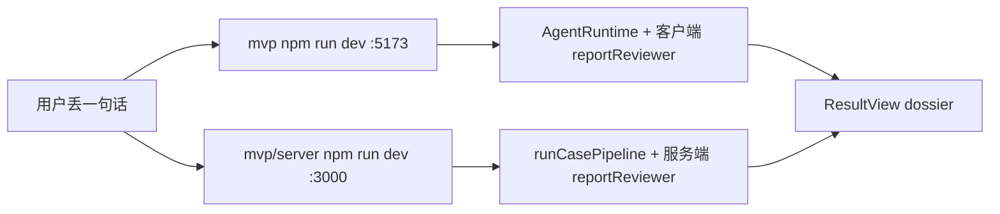

# 生产路径残留洞 · 能信 / 不能信仍会撒谎或丢条

日期：2026-08-19。
范围：用户丢一句话，应看见能信 / 不能信 / 还查不清，且原句每一截都在。
生产路径：`handlers` → `runCasePipeline` → `assembleFinalReport` + 服务端 `reportReviewer` → 前端 `ResultView`。
本机 `cd mvp && npm run dev` **不是**这条路径（见下）。

```text
Goal:     列出会撒谎或丢条的残留洞，并写清本机怎么走真人路径
Hard bar: 每条洞有触发条件、用户看见什么、文件、是否生产路径
Improve:  生产路径上会撒谎/丢条的洞的数量
```

---

## 两条入口



| 入口 | 端口 | 编排 | 审稿 | 按原子检索 / claimItems |
|------|------|------|------|-------------------------|
| `cd mvp && npm run dev` | Vite 默认 `127.0.0.1:5173` | `mvp/vite.config.ts` → `AgentRuntime.runCase` | `mvp/src/lib/agentRuntime/reportReviewer.ts` | 无 |
| 公网 / Express | `PORT` 或 `3000` | `handlers` → `runCasePipeline` | `mvp/server/src/lib/reportReviewer.ts` | 有 |
| `npm run preview` | Vite preview | 同一套 Vite 中间件，仍是 AgentRuntime | 客户端副本 | 无 |

ADR-003：生产真相是 Case Pipeline。
README 只写 `cd mvp && npm run dev`，本机按说明书走会进旧床。

---

## 必查六项

### 1. `compactStrings(..., 6)` 还在谁手里

函数体：`mvp/server/src/lib/claimAtom/merge.ts`。
`splitVerifiableAtoms` 第 114 行、`mergeSubclaimVerdicts` 第 56 行，都是 `compactStrings(claimAtoms, 6, 180)`。

`assembleFinalReport` **已绕开**：
- 全表用 `listAtomsForSearch`（上限 12，不是 6）。
- merge 只吃 `atomsSearched`（检索预算最多 6）。
- 未入选可核查条由 `applyUnsearchedAtomVerdicts` 补 `unverified` +「检索预算未覆盖」。
- `claimItems` 按 `rumorOutput.claimAtoms` 原序交错。

生产里仍走旧切 6 的调用方：

| 调用方 | 是否生产 | 干什么 |
|--------|----------|--------|
| `mvp/server/src/lib/agentConfigs.ts` `buildAgentInput("report_composer")` | **是**。`handlers.makeRunAgent` 每个 Agent 都调它 | `splitVerifiableAtoms` + `mergeSubclaimVerdicts` 切 6，塞进作曲家入参 |
| `mvp/src/lib/agentConfigs.ts` 同函数 | 否。Vite / AgentRuntime | 同上 |
| `assembleFinalReport` | 是，但只 merge **已检索** 的 ≤6 条 | 展示不靠这次切 6 |
| `runCasePipeline` | 不直接调 split | 落库走 assemble |
| `AgentRuntime` | 不走 assemble | 整句搜，没有第 7 条补洞 |

`agentConfigs` 里其它 `compactStrings(..., 6)` 是 handoff 文案截断（claimAtoms / sources），不是类型闸。

### 2. 两份 `reportReviewer` 分叉

| 副本 | 路径 | 整句无据 true/false |
|------|------|---------------------|
| 生产 | `mvp/server/src/lib/reportReviewer.ts` | 有 `unsourced_hard_verdict` + `boundTiny` 例外 |
| 本机 Vite | `mvp/src/lib/agentRuntime/reportReviewer.ts` | **没有** 这一闸 |

生产只走服务端那份（`runCasePipeline` 第 570 行）。
ch-18 验收已写明：浏览器副本未同步。

### 3. eval 条数、门禁、改基线

| 文件 | 条数 / 作用 |
|------|-------------|
| `mvp/server/eval/golden.ts` | **26** 条：RUMOR-001–014、TINY-001–007、LOOP-001–003、EVAL-UNVERIFIED-001、EVAL-TYPEGATE-001 |
| `mvp/src/lib/agentRuntime/evaluation/goldenDataset.ts` | 前端 14 条 RUMOR，不是生产评测 |
| `mvp/server/eval/baseline.json` | 仍是 **14** 条时期聚合（`totalCases: 14`，`passed: 5`） |

怎么跑：

```bash
cd mvp
npm run eval
npm run eval:gate
```

等价：`cd mvp/server && npx tsx eval/run.ts --gate eval/baseline.json`。
要真实 key：`mvp/.env.local` 里 `STEPFUN_API_KEY` / `DEEPSEEK_API_KEY` / `MINIMAX_API_KEY` / `MIMO_API_KEY` 至少一个。
还要搜索 key（`QIHOO_360_API_KEY` 等），否则检索空、结论会漂。

门禁：`score.ts` 先比 `totalCases` 必须相等，再比 `verdictAccuracy` / `routingAccuracy` / `reportContractPassRate`，容忍掉 5 个点。
现在 golden=26、baseline=14，**`eval:gate` 会因条数不一致直接失败**。

更新基线：全量 `npm run eval`（不要 `--gate`、不要 `--ids` / `--domain`）。
`run.ts` 会覆盖 `mvp/server/eval/baseline.json`。
不要手改历史 `.ship/evaluation/benchmark-history.jsonl` 当基线。

### 4. 本机怎么启动（真人路径）

前端：

```bash
cd mvp
npm install
# 复制 mvp/.env.local.example → mvp/.env.local，填模型 key + 360 搜索 key
npm run dev
```

打开 `http://127.0.0.1:5173`。
不要另开公网 host；`package.json` 绑的是 `--host 127.0.0.1`。
要 API key。没 key 会失败或走本机 Codex 回退，结论不可当生产。

后端（生产管线，**UI 默认打不中**）：

```bash
cd mvp/server
npm install
npm run dev
```

Express 听 `PORT` 或 **3000**，健康检查 `GET http://127.0.0.1:3000/health`。
Vite 自己挂了 `/api/agent/orchestrate-stream`，**不会**反代到 3000。
所以：浏览器丢一句话 = AgentRuntime，不是 `runCasePipeline`。

要对着生产管线走真人句，只能：
- 直接 `POST http://127.0.0.1:3000/api/agent/orchestrate-stream`（body `{ "claim": "…" }`），或
- 跑 `npm run eval`，或
- 用公网 / Docker（`mvp/docker-compose.yml` 把 API 绑在 `127.0.0.1:3000`，Nginx 反代）。

本探索不能列本机进程，没法确认 5173/3000 是否已在跑。
自己看终端，或打开上面两个地址。

### 5. `MemoryCandidatePanel` / 写入知识库 挂载条件

组件：`mvp/src/components/v3/MemoryCandidatePanel.tsx`。
挂在：`mvp/src/components/v3/phases/ResultView.tsx`。
生产 App 用 `variant="dossier"`（`mvp/src/App.tsx` 卷宗栏）。

会挂上，当且仅当：
1. `variant === "dossier"`（独立 `page` 变体不挂，测试写明）。
2. 报告不是 `_source === "error-boundary"`（中断页不挂）。
3. `knowledgeBase.listMemoryCandidates()` 里有 `provenance.claim === 当前 claim` 的条。
4. 面板自己：`candidates.length === 0` 则 `return null`。

数据从哪来：
- SSE `complete.memoryCandidates`（handlers 生产会带）。
- `MissionControlView` 写入浏览器 `knowledgeBase`（localStorage）。
- 管线同时 `propose` 到服务端 `JsonlMemoryCandidateStore`。

「写入知识库」按钮：只对 `status === "proposed"`。
点下去：`POST /api/agent/memory-candidates` `{ action: "setStatus", id, status: "accepted" }`，再写回 localStorage。
点「忽略」则 `rejected`。
未确认的 proposed **不进**后续召回。

预览路由 `/` 结果页默认 `page`，看不到这块。

### 6. `ResultView` 怎么画第 7 条、立场型、还查不清

`readClaimList` **不读** `finalReport.claimItems`。
有 `subclaimVerdicts` 就只画它；否则退回 `claimAtoms` 纯文本；再没有就空清单。

`ReportModal` 才读预交错 `claimItems`。
生产卷宗用的是 `ResultView`，不是 `ReportModal`。

| 条 | 服务端 `claimItems` | 用户在 ResultView 看见 |
|----|---------------------|------------------------|
| 第 7 条可核查（未检索） | 原句序，`unverified`，gaps 含「检索预算未覆盖」 | 会以 badge「还查不清」出现（在 `subclaimVerdicts` 里），**没有**「检索预算未覆盖」文案；顺序是检索序+补条，不是原句序 |
| 立场型 | `verifiable: false`，不进 `subclaimVerdicts` | **整条消失**。没有「立场型 / 不适用真/假」 |
| 还查不清 | `verdict: unverified` 或整句 `verdictType: unverified` | 条：badge「还查不清」。顶：`humanizeVerdictType` →「还查不清」。`evidence` 空则点不开详情 |

`humanizeVerdictType`：`true`→能信，`false`→不能信，`partial`/`mixed_misleading`→只能信一部分，`unverified`→还查不清。

---

## 生产路径仍会撒谎或丢条的洞

每条都过 Hard bar：触发 → 用户看见 → 文件 → 是否生产。

### 洞 A · ResultView 丢掉立场条

- 触发：原句拆出至少一条 `verifiable: false`（价值 / 规范），其余可核查。
- 用户看见：顶上能信或不能信；清单只有可核查条。立场截当没说过。
- 文件：`mvp/src/components/v3/phases/ResultView.tsx` `readClaimList`；对照 `assembleFinalReport.ts` `buildClaimItems`、`ReportModal.tsx`。
- 生产：是。handlers 写了 `claimItems`，结果页不用。

### 洞 B · 整句能信，不看未检索 / unverified

- 触发：≥7 条可核查；前几条有绑定 URL 的 true；第 7 条预算外 `unverified`。或同句里已有 unverified。
- 用户看见：顶上「能信」。下面一条「还查不清」。整句假装覆盖全句。
- 文件：`runCasePipeline.ts` 只在 `deriveOverallVerdict === "partial"` 时改 `false`→`mixed_misleading`；`deriveOverallVerdict` 算 true 时无视 unverified；`reportReviewer.ts` 只要有一条非 related-only URL 就不降整句 true。
- 生产：是。

### 洞 C · 作曲家入参仍先切 6

- 触发：可核查 + 立场合计 >6，或可核查 >6。
- 用户看见：整句结论按前 6 条写。assemble 虽补第 7 条 unverified，顶上 verdict 仍是模型那句。叠在洞 B 上。
- 文件：`mvp/server/src/lib/agentConfigs.ts` 约 784–799 行；`handlers.ts` `makeRunAgent`。
- 生产：是。`runCasePipeline` 自己不切 6，但 `runReport` → `buildAgentInput` 会切。

### 洞 D · 第 13 条静默消失

- 触发：自证后仍有 >12 条原子。
- 用户看见：第 13 条及以后不检索、不进 `listAtomsForSearch`、`buildClaimItems` 对不上 key 就跳过。整句仍像查完了。
- 文件：`selfProof.ts` `prefilterClaimAtoms` `slice(0, 12)`；`atomSearch.ts` `MAX_CLAIM_ATOMS_LISTED = 12`。
- 生产：是。少见，但是丢条。

### 不计入 N（仍要知道）

| 项 | 为什么不算生产撒谎洞 |
|----|----------------------|
| 本机 Vite / AgentRuntime 整句搜、无 claimItems、旧 reviewer | 不是 handlers 生产路径；README 真人入口会踩 |
| `merge`/`split` 内部仍切 6 | assemble 落库已绕开；伤在洞 C 的作曲家入参 |
| 未检索条不进补查 | 刻意。单独不撒谎；叠洞 B 才变成整句能信 |
| `boundTiny` 把 mixed/unverified 压成 false | 短谣例外，ch-18 要留 |
| reviewer 客户端缺闸 | 生产不走 |
| 知识库面板不挂 | 不改能信/不能信 |
| `eval:gate` 条数对不上 | 评测门坏了，不是单次结果页撒谎 |

---

## 本机建议走法

要看**现在公网上用户看见的那条**：不要只开 Vite。
开 Express `:3000`，用同一句 POST `orchestrate-stream`，把 `finalReport.claimItems` / `subclaimVerdicts` / `faceVerdict` 和结果页对照。
要看**说明书真人路径**：只开 `mvp` 的 `npm run dev`，同一句会走 AgentRuntime，第 7 条和立场更容易直接消失。

试一句：七截可核对事实，最后一截带「导致」或数字，中间夹一句「不该吃」。
生产管线应检索到「导致」那截；结果页仍会丢掉「不该吃」，且顶上仍可能写能信。

---

生产撒谎洞=4
