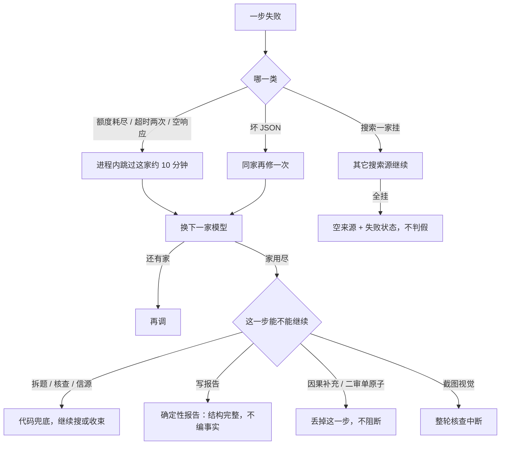

# 第 12 章 · 异常处理与恢复

## 裁决
done-in-our-form

## 分数
4 / 5

## 书要解决什么
工具挂掉、超时、格式错、服务不可用时，智能体不要整轮崩溃。
检测之后要有处理：记日志、重试、换路、降级、通知；再恢复到能继续的状态。
书的示例是 SequentialAgent 加一个 LLM 回退角色，失败了再让模型想办法，追求不中断、体验尽量顺。

## 我们有没有
有但形状不同。
书要 LLM 自己选回退、甚至用反思再试一遍。
我们用代码定：哪一步可继续、哪一步必须停、失败时用户看见什么。
对照书的 retry / fallback / circuit：

Retry：`mvp/server/src/lib/providerRouter.ts` 的 `json_repair_retry` 只对坏 JSON 同家再修一次。
额度、超时、空响应不重打同一家：2026-08-14 全模型额度耗尽时，重试只会再空等 3–5 分钟，最后「核查中断、一无所得」。
Fallback：`callAgentWithFallback` 按 minimax → stepfun → anthropic → deepseek → mimo → 360 → codex 换家。
`mvp/server/src/lib/casePipeline/runCasePipeline.ts` 的 `fallbackRumorStep` / `fallbackAgentStep` 让拆题、核查、信源失败后仍能收束。
`mvp/server/src/handlers.ts` 的 `runReportComposerWithFallback` → `buildDeterministicFinalReport` 是报告超时的确定性兜底。
Circuit：`mvp/server/src/lib/providerRouter.ts` 的 `quotaExhaustedUntil`（硬失败跳过约 10 分钟）、`timeoutStrikes`（连续两次超时再跳过）、`shouldSkipSlowFallback`（同一次调用已两次硬失败则跳过 Codex 90 秒档）。
`areCloudProvidersHardSkipped` 在家已全部跳过时直接失败，不再空转。
搜索：`callParallelSearchProviders` 用 `Promise.allSettled`；一家失败不阻断；全挂走 `build360SearchFailure`，空来源、`_source: "tool-error"`，不编摘要。
证据追索检索抛错记 `search-failed` 并判停，不把整案打掉：`mvp/server/src/lib/evidenceLoop/evidenceLoop.ts`。
可选失败继续：因果两步 `Promise.allSettled` 只收下成功的；二审单原子失败记 inconclusive，见 `mvp/server/src/lib/crossExam/crossExam.ts`。
核心失败阻断：截图视觉失败在流上发 `tool_error` 后抛错，整轮变成 `error` / 「核查中断」。
自证模型失败 fail-open：`runClaimAtomSelfProof` 捕获后保留原子继续搜。
故意不做：书的 LLM 回退角色、失败后再让模型反思改提示。
依据：`docs/PRODUCT_SPEC.md` 第五节、第六节；`docs/adr/ADR-002-deepagents-evaluation.md`；`docs/adr/ADR-003-production-case-pipeline.md`。
过程上失败显式：搜索 `_source === "tool-error"` 发 `tool_error`；角色失败发 `agent_error`；可恢复失败后仍 `complete`，不标成「核查中断」。
见 `mvp/src/lib/missionShell/streamAdapter.ts` 与 `mvp/src/lib/agentConfigs.ts` 的 `CONTINUE_AFTER_FAILURE_AGENTS`。
公开结论剥掉额度、超时、API 路径：`mvp/server/src/lib/reportSanitizer.ts`、`mvp/src/components/v3/phases/ResultView.tsx`。
落地页 `GET /api/models/health` 用人话提示服务不可用或不确定，不暴露厂商名：`mvp/server/src/lib/modelServiceHealth.ts`。
2026-08-14 实锤与修复记在 `mvp/docs/DEV-LOG.md`。

## 对能信/不能信的意义
失败必须露出来：搜索失败、超时、来源不可达是状态，不能补一段流畅解释假装查完了。
无证据不能写成假：搜索全挂、核查模型没跑完且没有可点开的辟谣链接时，收成「还查不清」，不是「不能信」。
报告超时仍要给得出结构完整的报告：能信 / 不能信 / 还查不清、来源、边界都在；空白和撒谎都不许。

## 缺口
核查模型失败时，`fallbackAgentStep` 若用 `isOnTopicDebunk` 扫到「像辟谣」的链接，会把 `factCheckResult` 写成 `false`。
确定性报告随后可能把整句收成「当前证据不支持该说法」。
伤害：用户看见「不能信」，以为查完了；其实核查模型没完成，只是检索标题/摘要像辟谣。
无链接时这条路径会走 `unverified` / 「还查不清」，这一截是对的。
