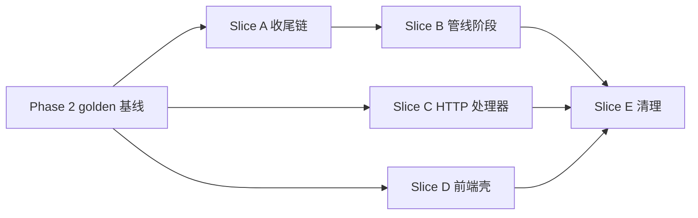

# 重写计划：增量竖切（2026-09-29）

一次只换一个边界。每片都走完同一套步骤，再开下一片：

```text
确认旧行为 → 表征测试（已有 + 补） → 新实现（保留旧接口） → 新旧对照（差分） → golden 回放 → 删旧实现 → commit
```

差分的做法统一为：**旧实现对同一输入的输出，作为新实现的预期**。
- 系统级：同一份录音，基线代码与新代码各回放一次，`golden.ts compare` 逐项比对（`golden-scenarios.md`）。
- 模块级：切片期间临时在旧代码的边界上加一个采集钩子（环境变量开启），golden 回放时把边界的真实输入与旧输出写进 `outputs/golden/capture/`；差分测试把每条采集输入喂给新实现，要求输出逐字段相等。切片结束时钩子与旧实现一起删除。

基线：`f96a37f` 的服务端 golden（标签 `base`）与界面 golden（标签 `ui-base`）。任何一片发现差异，先判断是新代码的错还是旧行为本身有问题；后者写进 `rewrite-issues.md` 等用户裁决，**不在切片里改**。

## Slice A：报告收尾链 → `finalize/finalizeReport.ts`

| 项 | 内容 |
|---|---|
| 边界 | `runCasePipeline.ts` 从 `assembleFinalReport` 到完成快照之前的收尾块（约 230 行） |
| 旧行为 | `behavior-spec` 12.1；`architecture-target` 2.3 的顺序 |
| 表征 | 已有：`runCasePipeline.test.ts`、`runCasePipeline.wholeClaimAudit.test.ts`（27 条）、`runCasePipeline.shannonConjunction.test.ts`、`reportAssembly`、`conclusionGate`、`sentenceVerdict`、`reportReviewer`、`citationLiveness` 各自的测试；golden 全部场景 |
| 新实现 | 有序步骤表；探活是注入的端口；返回收尾后的报告与 deadUrls |
| 差分 | 采集钩子记录每次收尾的输入（报告草稿、进行态切片、探活结果）与旧输出；新实现按采集的探活结果重放 |
| 删旧 | 删除内联块与采集钩子 |
| 风险 | 原地修改的对象引用：`reportStep.output` 与 `finalReport` 是同一对象，`factStep.output` 在守门里被改（`_factCheckResultDerived`）。新实现必须保留这些副作用，差分要比对 `factStep.output` |

## Slice B：管线阶段与进行态 → `stages/*`、`caseState.ts`、`budget.ts`、`snapshotTimeline.ts`

| 项 | 内容 |
|---|---|
| 边界 | `runCasePipeline` 函数体（Slice A 之后剩下的约 850 行） |
| 旧行为 | `architecture-current` 第 5 节阶段链；快照顺序 `state-model` 2.2 |
| 表征 | `runCasePipeline.*.test.ts` 全部（9 个文件）；golden 全部服务端场景（外部请求清单必须逐条相同：阶段顺序与请求内容不能变） |
| 新实现 | 八个阶段函数 + 进行态；`runCasePipeline` 只剩顺序与预算判断；对外签名与返回值不变 |
| 差分 | 系统级 golden（录音保证同一输入）；模块级复用现有 fake 驱动的测试 |
| 删旧 | 旧函数体整体替换，不留并存路径 |
| 风险 | 请求发出顺序与内容一变，录音就对不上（miss）。`network` 清单比对能立刻发现 |

## Slice C：HTTP 调查处理器 → `http/investigationRun.ts`、`http/sseChannel.ts`、`http/orchestrateStream.ts`

| 项 | 内容 |
|---|---|
| 边界 | `handlers.ts` 的 `orchestrateStreamHandler` 与 `investigationEventsHandler` |
| 旧行为 | `behavior-spec` 第 9、10 节；`state-model` 2.1、第 3 节 |
| 表征 | `handlers.*.test.ts`（6 个文件）、`orchestrateByo.test.ts`、`quotaPolicy.test.ts`、`checkQuota.test.ts`；golden g10–g20（停止、断线接回、重复提交、重启、全挂、检索挂、自带密钥、旧数据、额度、MCP、错误请求） |
| 新实现 | 结局枚举 + 结算表；SSE 通道共用 |
| 差分 | 系统级 golden；结局表对每个 catch 分支逐条对照写单测 |
| 删旧 | 删 catch 分支与重复的写帧代码 |
| 风险 | 帧顺序与额度结算时机；golden 的帧序列与 quota 查询结果能发现 |

## Slice D：前端产品壳 → `app/use*.ts`

| 项 | 内容 |
|---|---|
| 边界 | `App.tsx` 里的业务状态与副作用 |
| 旧行为 | `behavior-spec` 第 2、3、6、7、9 节；`state-model` 2.4 |
| 表征 | `App*.test.tsx`（4 个文件，35 条）、`stopAndResume`、`presentationIssue*`、`materialAndAccount`、`resultAndQuota`；界面 golden（逐帧 DOM、localStorage、客户端请求） |
| 新实现 | 四个 hook；App 只组合 |
| 差分 | 界面 golden 基线 `ui-base` 对比；浏览器端到端（Ego 脚本，数值断言） |
| 删旧 | App 内联状态整体移走 |
| 风险 | 副作用执行顺序（React effect 顺序跟声明顺序走）；界面 golden 的逐帧 DOM 与 localStorage 能发现 |

## Slice E：死代码与清理

| 项 | 内容 |
|---|---|
| 目标 | `ReasoningProvider` 与 `reasoningStore`（无消费者）、`casePipeline/testSourceRelationAudit.ts` 移到测试目录、`handlers.ts` 的过时注释、确认无用的再导出 |
| 表征 | 界面 golden；构建；全量测试 |
| 不在此片 | `styles.css` 的旧壳样式：需要像素对比的视觉 golden，另开一片且要用户看图裁决 |

## 顺序与依赖



A 在 B 之前：收尾链先独立出来，B 搬阶段时函数体已经短了一截。C、D 与 A/B 互不依赖。

## 每片完成时必须有的证据

1. `cd apps && npm test` 全过（与基线同一批用例）。
2. `cd apps && npm run build`、`cd apps/server && npx tsc --noEmit`、根目录 `npm test` 与 `npm run build` 全过。
3. `golden.ts replay <片名>` 后与 `base` 比对全部 PASS；界面相关的片再加界面 golden 比对。
4. 模块级差分（有采集语料的片）全部相等。
5. `docs/NOTES.md` 头部更新；commit 信息写清换了哪个边界、删了哪些旧实现、差分覆盖了多少条输入。
